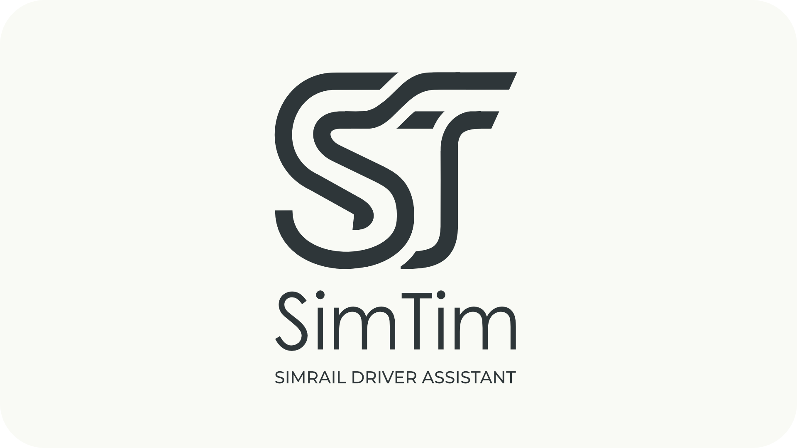
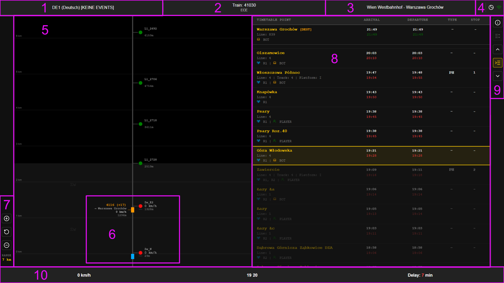

# SimTim - SimRail Driver Assistant

A real-time driver assistant and timetable companion for SimRail, inspired by the Dutch Railways (NS) "TimTim" system.

## About SimTim
**SimTim** is a utility tool designed to support train drivers in **SimRail**. It provides drivers with a comprehensive, real-time overview of their current schedule and the traffic ahead, allowing for better situational awareness and smoother driving.

The project is loosely inspired by **TimTim**, the digital timetable and driver assistant application used in real life by the Dutch Railways (*Nederlandse Spoorwegen - NS*).

## Key Features
* **Dual Timetable View:** Displays both scheduled and actual (live) times simultaneously to monitor delays or early running.
* **Live Route Path Radar:** Visualizes the track ahead, showing your predicted path and warning you about any trains directly in front of you.
* **Multi-Device LAN Hosting:** Run the application on your gaming PC and access the interface from any device (smartphone, tablet, or laptop) connected to the same local network.
* **Tkinter-Powered Desktop Base:** Built with Python's Tkinter framework, packaged as a clean, lightweight executable.

## ⚠️ Important Notices (API Limitations)
Because SimRail does not currently offer local data outputs, SimTim relies entirely on SimRail's public Web APIs. Please keep the following system behaviors in mind:
* **Data Latency:** There can be a slight delay in the displayed data, including your current speed. 
* **Timetable Index Dependency:** The active station index depends entirely on the session's Dispatcher marking your entry or departure in the EDR system. If a dispatcher registers this too early, SimTim will instantly jump to the next station.
* **Estimated Signal Indications:** The API does not provide real-time signal colors. Signal flags shown in SimTim are calculated using internal software logic. **Always look out the window and rely on the actual simulator signals; SimTim is strictly an assistant tool.**

## How it Works
SimTim functions as a data bridge between the simulator environment and the driver:
1. **Data Fetching:** The application currently queries SimRail's public Web APIs to retrieve live session and telemetry data. 
2. **Local Hosting:** Once launched, SimTim hosts a local interface over your network, allowing you to use a secondary screen without cluttering your main gaming monitor.

## Getting Started

### Installation
SimTim is packaged as a standalone executable (`.exe`), meaning you do not need Python installed on your system to run it.

1. Go to the **Releases** tab on the right side of this GitHub repository.
2. Download the latest `SimTim.zip` file.
3. Extract the `Dist` folder in a folder of your choice. That folder will now contain `SimTim.exe` and a `data` folder.
4. Create a shortcut or run `SimTim.exe` from that location. 

> ### ⚠️ Windows SmartScreen Notice
> Because this executable is an unsigned binary created via PyInstaller, Windows Defender SmartScreen will likely trigger a warning when you run it for the first time stating: *"Windows protected your PC"*. 
>
> This is completely normal for independent open-source tools. To launch the application:
> 1. Click on **"More info"** in the SmartScreen pop-up.
> 2. Click the **"Run anyway"** button that appears.

### Running the App & LAN Use
1. Launch `SimTim.exe` before or during your SimRail session.
2. The main window will display the application interface and host status.
3. **To use a secondary device:** Note the local IP address and port displayed in the application (e.g., `http://192.168.1.50:5000`). Enter this URL into the web browser of your smartphone, tablet, or second PC on the same Wi-Fi/network to view your radar and timetable externally.

## Display & Controls Overview
To help you navigate the SimTim interface, use the numbered guide below alongside the interface layout.

### Interface Elements & Buttons

#### Top Bar
* **[1] Server:** Select your server from the dropdown menu.
* **[2] Train:** Click on 'Select train' and enter your train number. After confirmation, the active service type will appear. You can change or update the service by clicking this number again.
* **[3] Service route:** Displays the scheduled route of your selected train service.
* **[4] Mode and connection:** 
  * Click the **Mode** button  to toggle the interface colors between Day, Dusk, and Night mode.
  * Click the **Connection** button  to view active API connection statuses.

#### Look-Ahead Section
* **[5] Look-ahead display:** Displays your predicted track, including upcoming signals (with indications when available), preceding traffic, and manually dispatched control areas.
* **[6] Train indication:** 
  * **Blue rectangle:** Represents your own train.
  * **Amber rectangle:** Represents the train directly ahead of you.
  * *Information provided:* Train number (including current delay), destination, speed, and distance relative to your position.
* **[6] Signals:** Displays the signal name, allowed speed at the signal, and distance to the signal. (See the color logic breakdown below). 
  * *Note:* Signals **without** a bar are Automated Block Signals (ABS). Signals **with** a bar are dispatcher-controlled signals (managed by a player or bot).
* **[7] Map controls:** Adjusts the map view between four distinct zoom levels: 10 km, 7 km, 5 km (Default), and 3 km. 
  *  Zoom in
  *  Reset zoom to default (5 km)
  *  Zoom out

#### Timetable Section
* **[8] Timetable display:** A comprehensive view of your active schedule.
  * **Timetable Point:** The station or checkpoint name. Displays line number (if known), track number (if known), and scheduled platform (if known). It also indicates the radio channel  and whether the sector is controlled by a  BOT or a  PLAYER dispatcher.
  * **Arrival:** The top value is the scheduled arrival time; the bottom value is the estimated actual arrival time (corrected with live delays).
  * **Departure:** The top value is the scheduled departure time; the bottom value is the estimated actual departure time (corrected with live delays).
  * **Type:** `PH` = Passenger stop, `PT` = Technical stop, `-` = Passing waypoint without a scheduled stop.
  * **Stop:** The planned duration of the stop.
* **[9] Timetable buttons:** Controls for navigating the schedule and toggling data views:
  *  **Info Panel:** Displays detailed route data, train metrics (power, weight, max speed), and the train consist layout.
  *  **Timetable View:** Switches back to the main schedule list.
  *  **Scroll Up:** Scroll up to review upcoming stations.
  *  **Center View:** Centers the display on the current/next station point (highlighted).
  *  **Scroll Down:** Scroll down to look at past stations.

#### Bottom Bar
* **[10] Information readouts:** Real-time telemetry tracking your current speed, server time, and exact delay delta.

---

### Signal Indications in SimTim

Because the SimRail Web API does not explicitly transmit signal aspect colors, SimTim uses internal software logic to estimate signal targets. **Always prioritize the visual signals outside your cab window.**

* <strong> Signal indication unknown:</strong> A 'dot-only' icon indicates an Automated Block Signal (ABS). If the icon also features a crossbar, the block is actively controlled by a dispatcher (bot or player). The exact aspect/indication is currently unknown.
* <strong> Steady - Vmax:</strong> Proceed at the maximum allowed line speed. 
  *Note: Because the API does not pass color data, an amber-colored signal in SimRail can still show as Vmax on the display, but practically means expect a stop ahead!*
* <strong> Flashing Green:</strong> The final signal block before entering a station yard *or* an upcoming line speed change to **130 km/h**.
* <strong> Speed limitation:</strong> Line speed at this signal is restricted to **100 km/h**. The physical signal may still display clear (double green).
* <strong> Speed limitation:</strong> Line speed at this signal is restricted to **60 km/h**. The physical signal may still display clear (double green).
* <strong> Flashing - Speed limitation:</strong> Target speed at this signal is **50 km/h**.
* <strong> Steady - Speed limitation:</strong> Target speed at this signal is **40 km/h**. 
* <strong> Stop:</strong> Danger. Do not pass this signal.

## Roadmap / Future Development
* [ ] Transition to local telemetry/data logging outputs once supported by SimRail.

## Support
Due to my professional occupation at sea, **I am away from home on a regular basis**. 

During my periods at home, I will actively dedicate time to maintenance, feature requests, and community support. Please understand that response times might be significantly longer during my rotation periods at sea. Your patience is highly appreciated!

* **Issues:** Open a ticket via the [GitHub Issues](https://github.com/Robbie-93/SimTim/issues) tab.
* **Discussions:** Feel free to share ideas or feedback in the community tab or in the post on the SimRail Forum.

## License
Distributed under the MIT License. See `LICENSE` for more information.